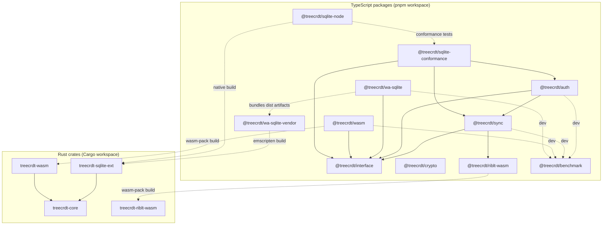

# Architecture

TreeCRDT is organized as a multi-runtime workspace with one shared model for operations, access control, and sync. The Rust crates provide the core engine and extension targets, while the TypeScript packages provide transport, auth, runtime adapters, and browser/node integration. The goal is to keep behavior consistent across native, WASM, and SQLite-backed deployments without forking protocol or data model semantics.

## Package Map

This map answers one question: which packages depend on which others. Arrow direction means "depends on / uses." Solid edges are runtime dependencies, and dotted edges are build, dev, or test-time relationships.

The diagram is intentionally scoped to library/runtime packages in this repository. Example applications such as Playground are left out to keep the dependency graph readable. `@treecrdt/crypto` is currently used in app/example flows for payload encryption and is not part of the runtime dependency chain between `@treecrdt/auth` and `@treecrdt/sync`.

## Core Data Model

At the center is an append-only operation log keyed by `OperationId { replica, counter }`, with Lamport ordering metadata and a kind (`insert`, `move`, `delete`, or `tombstone`). The implementation follows deterministic Tree CRDT rules so replicas converge from the same operation set, regardless of receive order. Access checks are applied before mutation, and partial replication is supported through subtree filters plus index-assisted lookups.

## Rust Integration Seams

The Rust core is designed around trait boundaries so the same CRDT logic can run over different storage/index backends:

| Trait | Responsibility |
| --- | --- |
| `Clock` | Provides Lamport/HLC progression (`LamportClock` is included). |
| `AccessControl` | Authorizes apply/read paths. |
| `Storage` | Persists and loads operations (`append`, `load since lamport`, `latest_lamport`). |
| `IndexProvider` | Optional acceleration for subtree queries and existence checks. |

`treecrdt-sqlite-ext` and related adapters implement these seams over SQLite tables and indexes instead of re-implementing CRDT rules.

## WASM and TypeScript Boundary

`treecrdt-wasm` exposes the Rust engine through `wasm-bindgen`, and `@treecrdt/interface` defines the shared TypeScript contract used by adapters and sync code. This keeps browser and node clients aligned on operation shape, storage adapter behavior, and sync/auth boundaries, whether the backing store is in-memory or wa-sqlite-based.

## Sync Model

The sync layer is transport-agnostic and exchanges operation batches with causal progress metadata. Subtree filters limit scope when needed, and responders enforce authorization at read time using capability checks plus filter constraints. Progress/checkpoint state is structured so sessions can resume without replaying the full history. The wire-level draft is documented in [`sync/v0.md`](sync/v0.md).

## Quality and Performance

The repository treats conformance and benchmarking as first-class architecture concerns. Rust and TypeScript tests cover unit and integration behavior, while `@treecrdt/sqlite-conformance` and `@treecrdt/benchmark` are used to validate correctness under realistic adapter and sync conditions, including browser/WASM paths.
