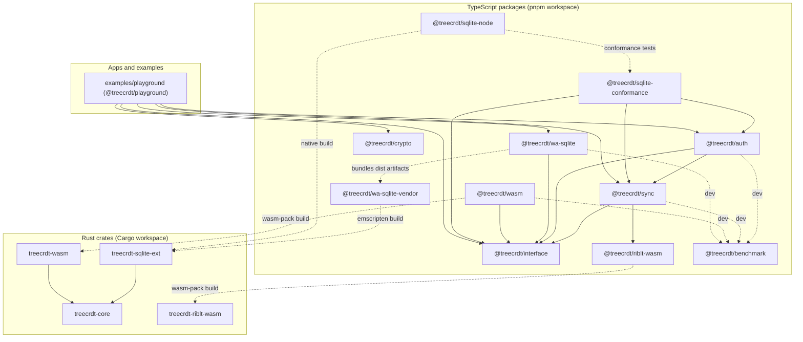

# Architecture

🚧 Work in progress 🚧 

## Goals
- Kleppmann Tree CRDT in Rust with clean traits for storage/indexing/access control.
- Runs native and WASM; embeddable as a SQLite/wa-sqlite extension.
- TypeScript interface stays stable across native/WASM/SQLite builds.
- Strong tests (unit/property/integration) and benchmarks (Rust + TS/WASM).

## Package map

This diagram is meant to answer, "What depends on what in this repo?".

Arrow direction is **depends on / uses**.
Solid arrows are runtime dependencies. Dotted arrows are build time, dev, or test connections.

## Core CRDT shape
- Operation log with `(OperationId { replica, counter }, lamport, kind)`; kinds: insert/move/delete/tombstone.
- Deterministic application rules following Kleppmann Tree CRDT; extend to support alternative tombstone semantics if needed (per linked proposal).
- Access control hooks applied before state mutation.
- Partial sync support via subtree filters + index provider for efficient fetch.

## Trait contracts (Rust)
- `Clock`: lamport/HLC pluggable (`LamportClock` provided).
- `AccessControl`: guards apply/read.
- `Storage`: append operations, load since lamport, latest_lamport.
- `IndexProvider`: optional acceleration for subtree queries and existence checks.
- These traits are the seam for SQLite/wa-sqlite implementations; extension just implements them over tables/indexes.

## WASM + TypeScript bindings
- `treecrdt-wasm`: wasm-bindgen surface mapping to `@treecrdt/interface`.
- `@treecrdt/interface`: TS types for operations, storage adapters, sync protocol, access control.
- Provide both in-memory adapter and SQLite-backed adapter (via wa-sqlite) to satisfy the interface.

## Sync engine concept
- Transport-agnostic: push/pull batches with causal metadata + optional subtree filters.
- Progress hooks for UI, resumable checkpoints via lamport/head.
- Access control enforced at responder using subtree filters and ACL callbacks.
- Draft protocol: [`sync/v0.md`](sync/v0.md)
