# Defensive Deletion (Fenton Deletion)

Defensive deletion is a CRDT deletion strategy that prevents accidental permanent deletion when a delete operation was unaware of concurrent modifications to a node's subtree. This approach ensures that nodes are only permanently deleted when the delete operation had full awareness of all subtree modifications at the time of deletion.

## Why Defensive Deletion is Needed

In distributed systems with eventual consistency, operations can arrive out of order or be created concurrently across different replicas. This creates a critical problem for deletion:

**The Problem**: A delete operation might execute without seeing all modifications to the subtree it's trying to delete. Without defensive deletion, this could permanently remove nodes that have valid concurrent modifications, leading to data loss.

**Example Scenario**:
- Client A deletes a parent node, thinking it's empty
- Client B concurrently inserts a child into that parent
- Without defensive deletion: The parent and child would be permanently lost
- With defensive deletion: The parent is restored when the child insert is discovered

Defensive deletion addresses this by using **awareness tracking** rather than immediate deletion, allowing automatic recovery when deletions were premature.

## How Defensive Deletion Works

Defensive deletion uses a three-phase approach: **Capture**, **Tombstone**, and **Validate**.

### Phase 1: Capture - Recording Awareness

When a delete operation is created:

1. **Calculate Subtree Version Vector**: The system recursively calculates all operations affecting the node and its entire subtree
   - Includes the node's own operations
   - Recursively includes all children's subtree version vectors
   - Represents "all operations that affect this subtree"

2. **Store as Known State**: The calculated version vector is stored as `known_state` in the delete operation
   - This captures "what we knew about this subtree when we deleted it"
   - This snapshot travels with the delete operation to other replicas

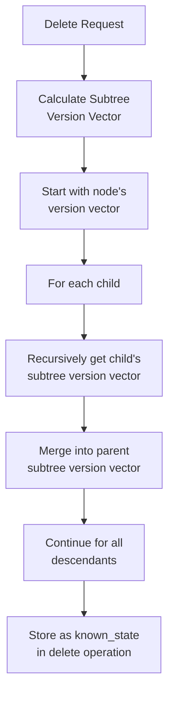

### Phase 2: Tombstone - Marking as Deleted

When a delete operation is applied (locally or remotely):

1. **Merge Awareness**: The delete operation's version vector is merged with its `known_state`
   - This merged version vector represents "what the delete operation was aware of"

2. **Store Tombstone**: The merged version vector is stored in the node's `deleted_at` field
   - The node is now considered "tombstoned"
   - The node is **NOT** removed from the tree structure
   - Tombstoned nodes are hidden from queries but preserved internally

3. **Multiple Deletes**: If multiple delete operations target the same node, their version vectors are merged
   - The node remains tombstoned only if **ALL** deletes combined were aware

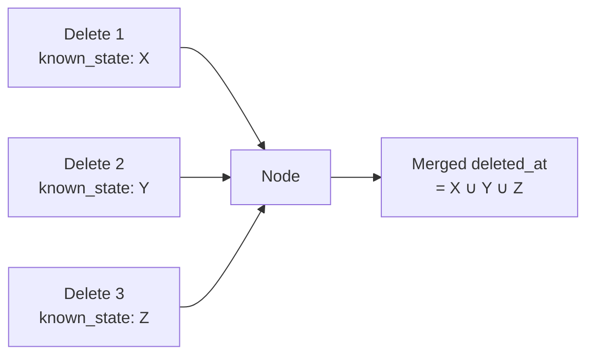

### Phase 3: Validate - Dynamic Restoration

Tombstone status is checked **dynamically** whenever the node is accessed:

1. **Calculate Current State**: Recalculate the subtree version vector for the node
   - This reflects the current state (may have changed since delete)

2. **Compare Awareness**: Compare the delete's awareness (`deleted_at`) with current state
   - **Delete aware of current subtree** → Node stays tombstoned (permanent delete)
   - **Delete unaware of current subtree** → Node is restored (delete was premature)

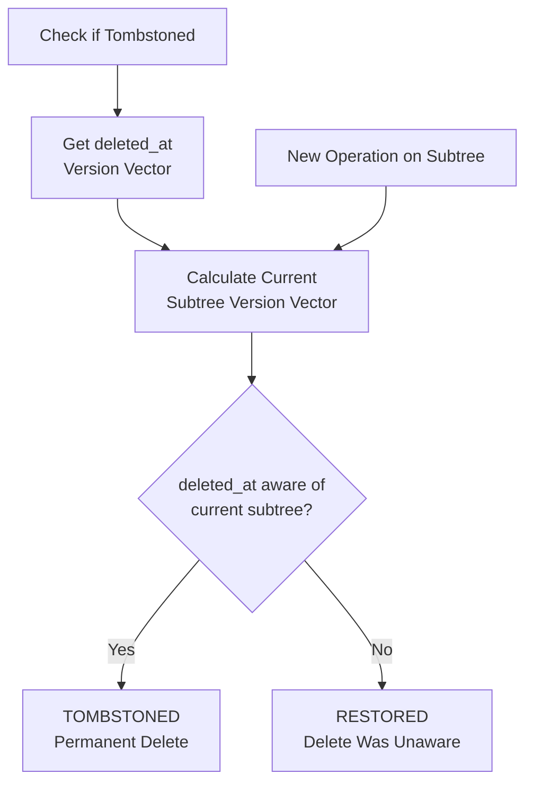

### Key Insight

The tombstone status depends on **causal awareness**, not timestamps. A delete with a higher timestamp can still be restored if it was causally unaware of earlier operations. This ensures correctness even with network partitions, delays, and out-of-order delivery.

## Complete Operation Flow

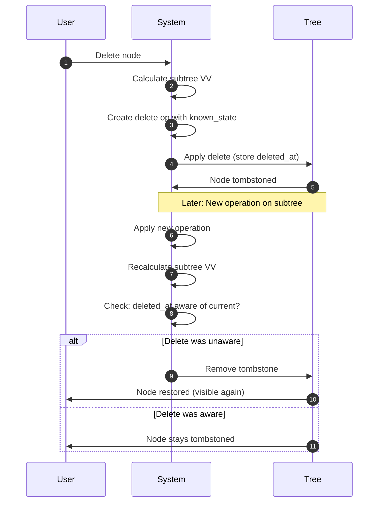

## Example: Concurrent Delete and Insert

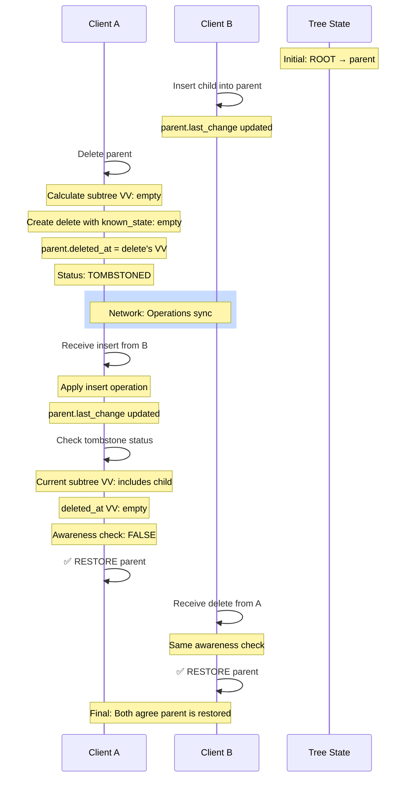

## Corner Cases and Scenarios

### 1. Delete Then Insert Child

**Scenario**: Parent is deleted without knowledge of a concurrent child insert.

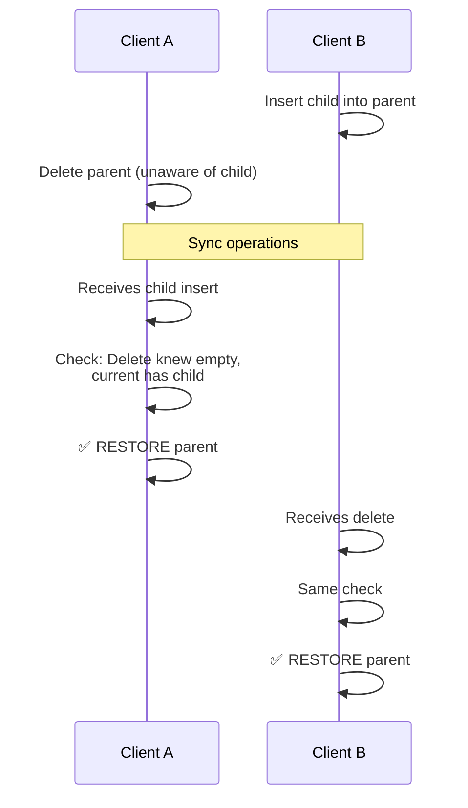

**Result**: Parent is restored because delete was unaware of the child.

### 2. Insert Then Delete (With Awareness)

**Scenario**: Child is inserted, then parent is deleted with full awareness.

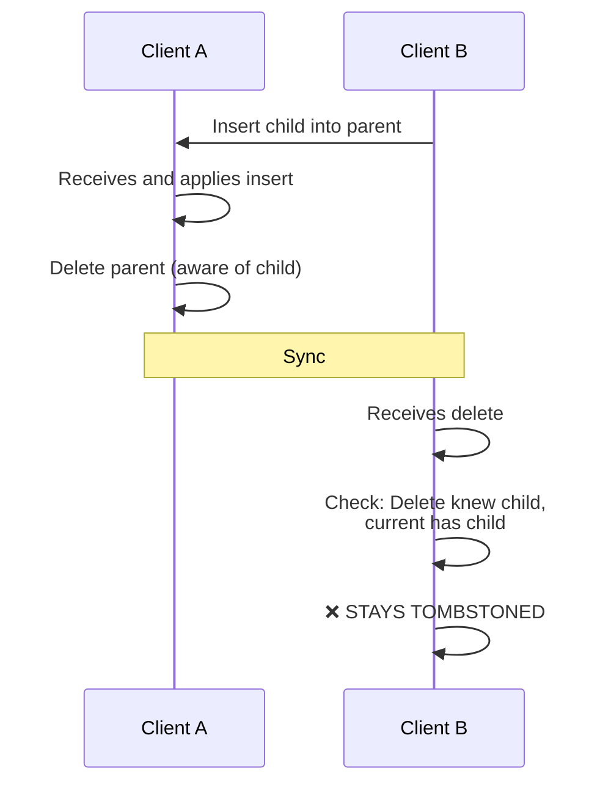

**Result**: Parent remains tombstoned because delete happened with full awareness.

### 3. Delete Then Move Child

**Scenario**: Parent is deleted while a child is concurrently moved into it.

```mermaid
graph LR
    subgraph Before Delete
        ROOT1[ROOT]
        P1[parent]
        OP1[other_parent]
        C1[child]
        ROOT1 --> P1
        ROOT1 --> OP1
        OP1 --> C1
    end
    
    subgraph After Move
        ROOT2[ROOT]
        P2[parent]
        OP2[other_parent]
        C2[child]
        ROOT2 --> P2
        ROOT2 --> OP2
        P2 --> C2
    end
    
    Before Delete --> After Move
    Note[Delete unaware of move] --> Restore[✅ RESTORE]
```

**Result**: Parent is restored because delete was unaware of the move operation.

### 4. Multiple Children Inserted

**Scenario**: Multiple children are inserted, delete sees some but not all.

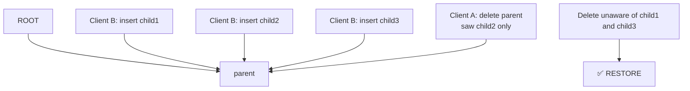

**Key Insight**: Even if delete saw some children, unawareness of others triggers restoration.

### 5. Grandchild Modifications

**Scenario**: Delete a parent while a grandchild is moved to a different subtree. This demonstrates that subtree version vectors include all descendants recursively.

```mermaid
graph LR
    subgraph Before Delete
        P1[parent]
        C1[child]
        GC1[grandchild]
        OP1[other_parent]
        P1 --> C1
        C1 --> GC1
    end
    
    subgraph After Move
        P2[parent]
        C2[child]
        GC2[grandchild]
        OP2[other_parent]
        P2 --> C2
        OP2 --> GC2
    end
    
    Before Delete --> After Move
    
    Note[Delete unaware of grandchild move<br/>Subtree VV includes all descendants] --> Restore[✅ RESTORE]
```

**Key Point**: Subtree version vectors include **all descendants** recursively:
- When calculating parent's subtree version vector, we include:
  - Parent's own operations
  - Child's subtree version vector (which includes grandchild)
  - All descendants' operations

Therefore, any modification to any descendant (child, grandchild, great-grandchild, etc.) can trigger restoration of ancestor nodes if the delete was unaware.

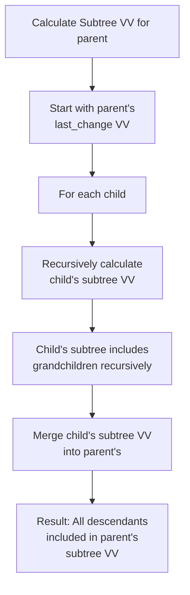

### 6. Later Delete Unaware (Lamport Edge Case)

**Scenario**: Delete has higher Lamport timestamp but was created before receiving an earlier operation.

```
Timeline:
  T1: Client B creates insert (lamport=5)
  T2: Client A creates delete (lamport=6) - but hasn't received insert yet!
  T3: Insert arrives at A
  T4: Delete arrives at B

Result: Even though delete has higher lamport (6 > 5), 
        it was unaware → ✅ RESTORE
```

**Important**: Awareness is based on causal knowledge, not timestamps. This ensures correctness even when operations arrive out of order.

### 7. Multiple Concurrent Deletes

**Scenario**: Multiple clients delete the same node concurrently without seeing an insert.

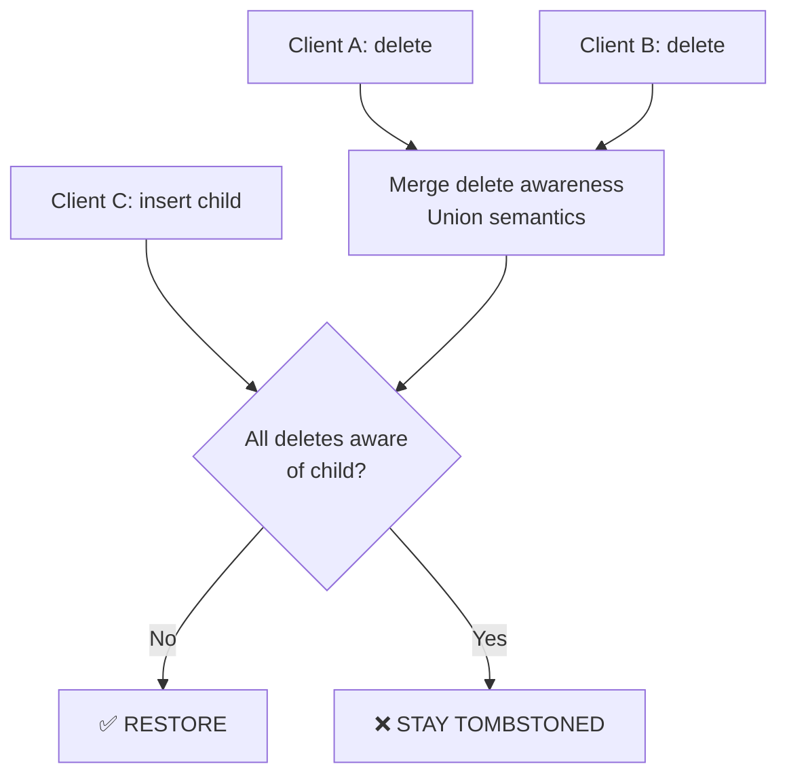

**Mechanism**: Delete awareness merges (union semantics), but if the merged awareness is insufficient, restoration occurs.

### 8. Missing Earlier Operation from Same Replica

**Scenario**: Receiving a later operation doesn't imply awareness of earlier operations (requires dotted version vectors).

```
Operations from Client B:
  B:1 = insert(parent, child1)
  B:2 = insert(parent, child2)

Client A:
  1. Receives B:2 first (out of order!)
  2. Version vector: B.frontier=0, B.ranges=[(2,2)]
  3. Deletes parent → known_state includes B:2
  4. Receives B:1 → Version vector: B.frontier=2, B.ranges=[]
  5. Current subtree has B:1 and B:2
  6. Delete only knew about B:2

Result: ✅ RESTORE (delete was unaware of B:1)
```

**Why This Matters**: With traditional version vectors (max_seen), seeing B:2 would incorrectly imply awareness of B:1. Dotted version vectors correctly track gaps, ensuring accurate awareness.

## State Transitions

A node's tombstone status can change over time:

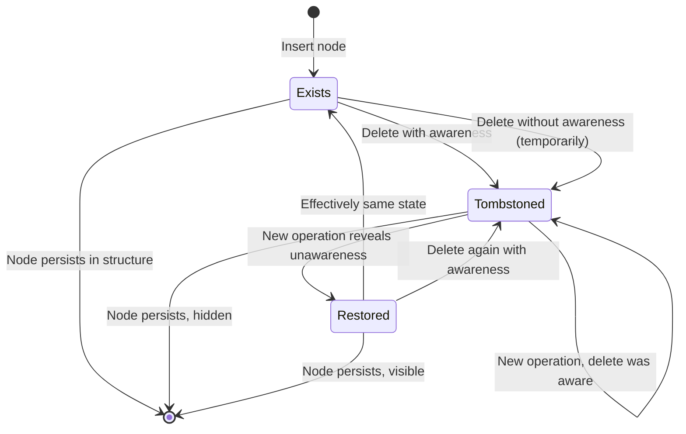

## Key Properties

### Dynamic Status
A node's tombstone status can **change over time** as new operations arrive. This is different from traditional CRDTs where deletion is typically permanent.

### Causal Awareness Over Timestamps
Tombstone status depends on **what was known**, not **when it happened**. A later delete can be restored if it was causally unaware.

### Recursive Subtree Tracking
Subtree version vectors include all descendants. Any modification to any descendant can trigger restoration of ancestors.

### Convergence
All replicas eventually agree on tombstone status based on causal awareness, not timestamps or delivery order.

### Preservation
Tree structure is never corrupted. Nodes are never actually removed - only visibility changes based on tombstone status.

## Benefits

1. **Safety**: Prevents accidental permanent deletion from concurrent operations
2. **Convergence**: All replicas eventually agree on tombstone status
3. **Causal Correctness**: Uses causal awareness rather than timestamps
4. **Network Resilience**: Works correctly even with out-of-order delivery, network partitions, and partial replication
5. **Automatic Recovery**: Premature deletions are automatically restored when concurrent operations are discovered

## Related Concepts

- **Version Vectors**: Track what operations each replica has observed (see [Version Vectors](./version-vectors.md))
- **Dotted Version Vectors**: Version vectors that can represent gaps, essential for accurate awareness tracking
- **Causal Awareness**: Understanding the causal relationship between operations, not just temporal ordering
- **Tombstones**: Deletion markers that preserve structure while hiding nodes from queries

## Further Improvements

### Current Implementation: Dynamic Calculation

Currently, deletion status is **not materialized state** but rather a **dynamically calculated state** that is computed on-demand whenever a node's tombstone status is checked.

**How it works now**:
- The `deleted_at` field stores the delete operation's awareness (version vector)
- When checking if a node is tombstoned, the system:
  1. Retrieves the `deleted_at` version vector
  2. Calculates the current subtree version vector (recursively)
  3. Performs an awareness check to determine tombstone status
- The result is computed each time, not stored

**Characteristics**:
- ✅ **Correctness**: Always reflects current state
- ✅ **Memory efficient**: No redundant state storage
- ⚠️ **Performance**: Requires recursive calculation on every tombstone check
- ⚠️ **Computation cost**: O(depth × nodes) for subtree version vector calculation

### Potential Improvement: Materialized State

For performance optimization, it may be beneficial to **materialize the tombstone status** as an explicit boolean flag that is updated when relevant operations occur.

**Potential approach**:
- Store an explicit `is_tombstoned` boolean flag in node state
- Update this flag when:
  - A delete operation is applied
  - Operations modify the subtree (insert, move operations)
  - Operations arrive that change awareness relationships
- Maintain consistency by invalidating/recalculating when subtree operations occur

**Trade-offs**:
- ✅ **Performance**: Fast tombstone checks (O(1) lookup vs O(depth × nodes) calculation)
- ✅ **Query efficiency**: No recursive computation needed for visibility checks
- ⚠️ **Complexity**: Requires maintaining consistency between materialized state and actual awareness
- ⚠️ **Memory**: Additional storage per node
- ⚠️ **Update overhead**: Need to update materialized state when subtree operations occur

**Considerations**:
- The materialized state would need to be invalidated and recalculated whenever:
  - New operations modify any node in the subtree
  - Operations arrive that change version vector relationships
- Need to ensure the materialized state accurately reflects the dynamic calculation
- May require incremental updates or lazy invalidation strategies

### Summary of Improvement Points

1. **Current limitation**: Dynamic calculation requires recursive subtree version vector computation on every tombstone check, which can be expensive for deep trees.

2. **Potential optimization**: Materialize tombstone status as explicit boolean flags to enable O(1) lookup performance.

3. **Challenges**: Maintaining consistency between materialized state and awareness-based calculation, especially when operations modify subtrees.

4. **Future work**: Design an efficient invalidation and update strategy that maintains correctness while improving query performance.

## Summary

Defensive deletion ensures safe deletion in distributed systems by:
1. **Capturing awareness** at delete time (known_state)
2. **Marking nodes with tombstones** (deleted_at) instead of removing them
3. **Dynamically validating awareness** (compare with current state)
4. **Restoring if delete was unaware** (automatic recovery)

This approach maintains data integrity even with concurrent modifications, out-of-order delivery, and network partitions, making it essential for reliable distributed tree structures.
