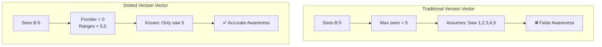

# Version Vectors

Version vectors are a fundamental mechanism for tracking causal knowledge in distributed systems. TreeCRDT uses **dotted version vectors** (also called gap-aware version vectors) to accurately track what operations each replica has observed, including gaps in the observation sequence.

## What Are Version Vectors?

A version vector tracks what operations from each replica have been observed. It's a map from replica identifiers to information about observed operations.

### Traditional Version Vectors

A traditional version vector tracks only the **maximum counter** seen from each replica:

```
Version Vector = {Replica A: 5, Replica B: 3, Replica C: 7}
```

**Assumption**: Seeing counter N implies you've seen all counters 1..N (contiguous observation).

**Problem**: This assumption is false in real distributed systems where:
- Operations may arrive out of order
- Partial replication may miss some operations
- Filtered sync may only receive specific operations

### Dotted Version Vectors

TreeCRDT uses **dotted version vectors** that track **exactly** what has been observed, including gaps.

**Structure**: For each replica, we track:
1. **Frontier**: The highest **contiguous** counter range starting from 1
   - If you've seen 1, 2, 3, 4, 5 → frontier = 5
   - If you've seen 1, 2, but not 3, 4, 5 → frontier = 2

2. **Ranges**: Additional observed counters beyond the frontier, stored as inclusive ranges
   - If frontier = 2 and you've seen 5, 6, 8 → ranges = [(5, 6), (8, 8)]

### Visual Example

```
Operations from Replica B: [1, 2, 5, 6, 8]

Traditional Version Vector:
  B: 8  (incorrectly assumes we've seen 1-8)

Dotted Version Vector:
  B: {
    frontier: 2,           ← contiguous [1..2]
    ranges: [(5, 6), (8, 8)]  ← gaps: missing 3, 4, 7
  }

Visual representation:
  1  2  3  4  5  6  7  8
  ✓  ✓  ✗  ✗  ✓  ✓  ✗  ✓
  └───┘        └─┘     └
  frontier    ranges   range
```



## How Version Vectors Are Used in TreeCRDT

Version vectors are used in several key places in the TreeCRDT implementation:

### 1. Node State Fields

Each node in the tree maintains version vector information:

- **`last_change`**: Version vector tracking the last operation that modified this node
  - Updated when insert, move, or delete operations affect the node
  - Represents "what operations have modified this node"

- **`deleted_at`**: Optional version vector storing delete operation awareness
  - Set when a delete operation is applied
  - Represents "what the delete operation knew about the subtree"
  - Used to determine if a node is tombstoned

### 2. Operation Metadata

Each operation carries version vector information:

- **Operation Version Vector**: The version vector for the operation itself
  - Created from the operation's replica ID and counter
  - Represents "this specific operation"

- **`known_state`** (in delete operations): Optional version vector capturing subtree awareness at delete time
  - Calculated when creating a delete operation
  - Represents "what we knew about the subtree when deleting"
  - Travels with the delete operation to other replicas

### 3. Global Replica Tracking

The system maintains a global version vector tracking all operations observed:

- Tracks what operations have been observed from each replica
- Updated whenever an operation is applied (locally or remotely)
- Used for reconciliation and determining what operations are missing

## How Version Vectors Are Calculated

### Observing an Operation

When an operation is observed from a replica with counter C:

**Process**:
- If C ≤ frontier: Already seen, ignore
- If C = frontier + 1: Extend frontier (fills a gap), then absorb any adjacent ranges
- If C > frontier + 1: Add to ranges, merging with adjacent ranges if they connect

**Example**:
```
Initial: frontier = 2, ranges = []

Observe counter 3:
  → frontier = 3 (extends contiguous range)

Observe counter 5:
  → frontier = 3, ranges = [(5,5)]

Observe counter 4:
  → frontier = 5 (fills gap, merges with range 5)
  → ranges = [] (all contiguous now)
```

### Merging Version Vectors

When merging two version vectors (e.g., when syncing with another replica):

**Process**: Collect all ranges from both vectors, sort, merge overlapping/adjacent ranges. The largest contiguous range starting at 1 becomes the new frontier.

**Example**:
```
Client A's VV for replica B:
  frontier = 2, ranges = [(5,5)]

Client B's VV for replica B:
  frontier = 3, ranges = [(7,8)]

After merge:
  Collect: [1,2], [5], [1,2,3], [7,8]
  Sort and merge: [1,2,3], [5], [7,8]
  Result: frontier = 3, ranges = [(5,5), (7,8)]
```

### Calculating Subtree Version Vectors

This is critical for defensive deletion. When calculating what operations affect a subtree:

**Process**:
1. Start with the node's own `last_change` version vector
2. For each child, recursively calculate its subtree version vector
3. Merge each child's subtree version vector into the parent's
4. Result: A version vector representing all operations affecting this node and all its descendants

**Example**:
```
Tree structure:
  parent (last_change: {A:1})
    ├── child1 (last_change: {B:2})
    │   └── grandchild (last_change: {C:3})
    └── child2 (last_change: {D:4})

Calculation:
  1. subtree_vv = {A:1}
  2. child1 subtree = {B:2} ∪ {C:3} = {B:2, C:3}
  3. subtree_vv = {A:1} ∪ {B:2, C:3} = {A:1, B:2, C:3}
  4. child2 subtree = {D:4}
  5. Result: {A:1, B:2, C:3, D:4}
```

## Awareness Check

The critical operation for defensive deletion is checking if one version vector is aware of another:

**Definition**: Version vector A is **aware of** version vector B if A has observed all operations that B has observed.

**For each replica R in B**:
- A must have frontier ≥ B's frontier (has all contiguous operations)
- A must contain every range in B's ranges (has all non-contiguous operations)

**Example**:
```
Delete's known_state:  {B: frontier=2, ranges=[(5,5)]}
Current subtree:       {B: frontier=3, ranges=[]}

Check: Is delete aware?
  - Delete has frontier=2, subtree has frontier=3
  - Delete is missing operations 3 (within contiguous range)
  - Result: NO, delete was unaware → RESTORE node
```

## Which Operations Use Version Vectors

### Insert Operations
- Update the inserted node's `last_change` version vector
- Update the parent node's `last_change` version vector
- Include operation's version vector in both updates

### Move Operations
- Update the moved node's `last_change` version vector
- Update the old parent's `last_change` version vector
- Update the new parent's `last_change` version vector
- Include operation's version vector in all updates

### Delete Operations
- Calculate subtree version vector → store as `known_state` in operation
- Create delete operation's version vector
- Merge operation VV with `known_state` → store in node's `deleted_at`
- Update node's `last_change` version vector (if not already updated)

## How Version Vectors Are Sent Between Clients

Version vectors are serialized and sent as part of operations during synchronization:

### In Delete Operations

Delete operations carry `known_state` as an optional field:
- Serialized as part of the operation metadata
- Sent to other replicas when syncing
- Other replicas use it to check awareness when applying the delete

### During Synchronization

When replicas sync:
1. **Reconciliation**: Version vectors help determine what operations each replica is missing
2. **Operation Transfer**: Operations are sent with their version vector information
3. **Awareness Updates**: Receiving replicas merge version vectors to update their knowledge

### Serialization Format

Version vectors are serialized as:
- A map/dictionary from replica identifiers to version information
- Each replica's version includes:
  - Frontier: single number (highest contiguous counter)
  - Ranges: array of [start, end] pairs for non-contiguous ranges

**Example serialized format**:
```
{
  "replica_A": {
    "frontier": 5,
    "ranges": [[7, 8], [10, 10]]
  },
  "replica_B": {
    "frontier": 3,
    "ranges": []
  }
}
```

## Why Dotted Version Vectors for Defensive Deletion?

Traditional version vectors (max_seen) would incorrectly handle scenarios like:

**Scenario**:
1. Receive operation B:5 (child insert)
2. Delete parent with known_state including B:5
3. Later, receive B:1 (earlier child insert you missed)

**With traditional version vectors**: 
- Seeing B:5 would imply awareness of B:1-5
- Delete would incorrectly appear aware → node stays tombstoned ❌

**With dotted version vectors**:
- Seeing B:5 is tracked as frontier=0, ranges=[(5,5)]
- When B:1 arrives, it extends the frontier
- Delete's known_state shows it only knew about B:5, not B:1
- Correct awareness check → node is restored ✅

This accurate awareness tracking is essential for defensive deletion correctness.

## Mathematical Properties

### Partial Order

Version vectors form a partial order:
- A ≥ B if A is aware of B (A has seen everything B has seen)
- If A ≥ B and B ≥ A, then A = B (they've seen the same operations)
- If neither A ≥ B nor B ≥ A, they are concurrent

### Convergence

When two replicas sync:
- Their version vectors merge (union of observations)
- Both replicas end up with the same merged version vector
- This enables eventual consistency

### Idempotency

Observing the same operation multiple times has no effect:
- The version vector structure prevents duplicate tracking
- Operations are deduplicated by operation ID

## Relationship to Vector Clocks

Version vectors are related to vector clocks but serve different purposes:

- **Vector Clocks**: Assign timestamps to events, establish happened-before relationships, used for causality
- **Version Vectors**: Track what operations have been observed, enable awareness checks, used for reconciliation

In TreeCRDT:
- **Lamport timestamps** (vector clock component) are used for operation ordering
- **Version vectors** are used for awareness tracking and defensive deletion

## Summary

Dotted version vectors in TreeCRDT:
- **Track gaps accurately**: Explicitly represent what has and hasn't been observed
- **Used in node state**: `last_change` and `deleted_at` fields
- **Used in operations**: `known_state` in delete operations
- **Calculated recursively**: Subtree version vectors include all descendants
- **Enable awareness checks**: Determine if delete operations were aware of modifications
- **Serialized for sync**: Sent between replicas as part of operations
- **Essential for correctness**: Enable defensive deletion to work correctly with partial replication and out-of-order delivery

This gap-aware tracking is what makes defensive deletion safe and correct in distributed systems with eventual consistency.
